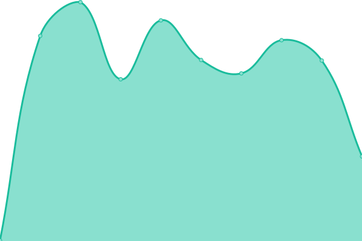
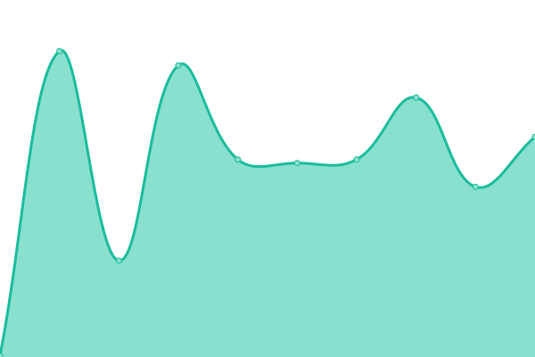
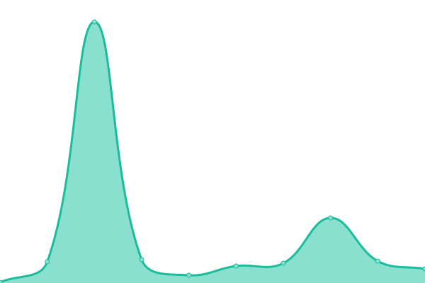

# [📈 Live Status](https://status.zerio.se): <!--live status--> **Alla system fungerar**

This repository contains the open-source uptime monitor and status page for [Zerio AB](https://zerio.se), powered by [Upptime](https://github.com/upptime/upptime).

With [Upptime](https://upptime.js.org), you can get your own unlimited and free uptime monitor and status page, powered entirely by a GitHub repository. We use [Issues](https://github.com/Zerio-AB/status-page/issues) as incident reports, [Actions](https://github.com/Zerio-AB/status-page/actions) as uptime monitors, and [Pages](https://status.zerio.se) for the status page.

<!--start: status pages-->
<!-- This summary is generated by Upptime (https://github.com/upptime/upptime) -->
<!-- Do not edit this manually, your changes will be overwritten -->
<!-- prettier-ignore -->
| URL | Status | History | Response Time | Uptime |
| --- | ------ | ------- | ------------- | ------ |
|  [zerio.se](https://zerio.se) | Uppe | [zerio-se.yml](https://github.com/Zerio-AB/status-page/commits/HEAD/history/zerio-se.yml) | 

 407ms
     
 | 

<a href="https://status.zerio.se/history/zerio-se">99.92%</a>
    

|  [restaurant.zerio.se](https://restaurant.zerio.se) | Uppe | [restaurant-zerio-se.yml](https://github.com/Zerio-AB/status-page/commits/HEAD/history/restaurant-zerio-se.yml) | 

 177ms
     
 | 

<a href="https://status.zerio.se/history/restaurant-zerio-se">99.92%</a>
    

|  [restaurant.zerio.se API](https://restaurant.zerio.se/api/health) | Uppe | [restaurant-zerio-se-api.yml](https://github.com/Zerio-AB/status-page/commits/HEAD/history/restaurant-zerio-se-api.yml) | 

 31ms
     
 | 

<a href="https://status.zerio.se/history/restaurant-zerio-se-api">99.92%</a>
    

<!--end: status pages-->

[**Visit our status website →**](https://status.zerio.se)

## 📄 License

- Powered by: [Upptime](https://github.com/upptime/upptime)
- Code: [MIT](./LICENSE) © [Anand Chowdhary](https://anandchowdhary.com), supported by [Pabio](https://pabio.com)
- Data in the `./history` directory: [Open Database License](https://opendatacommons.org/licenses/odbl/1-0/)
